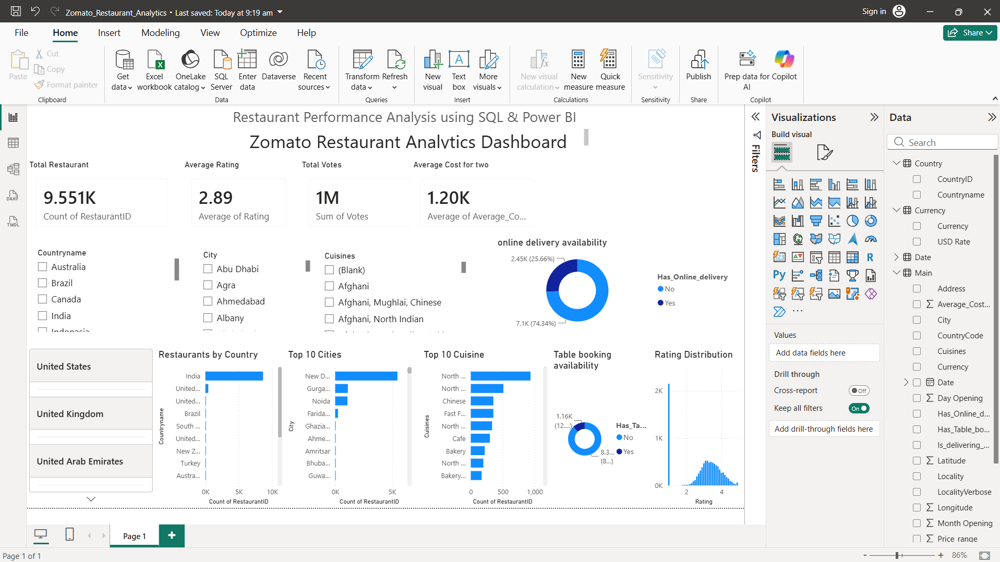

# Zomato-Restaurant-Analytics
Interactive Restaurant Analytics Dashboard using SQL, Power BI, and Excel.
# 🍽️ Zomato Restaurant Analytics Dashboard

## 📌 Project Overview

This project is based on Zomato restaurant data and focuses on analyzing restaurants using SQL and Power BI. The goal was to convert raw data into meaningful insights that can help understand restaurant performance, customer preferences, pricing, ratings, and service availability.

Instead of looking at thousands of rows of data, the dashboard provides an easy way to explore the information through interactive charts and filters.

---

## 🎯 Objectives

- Analyze restaurant data from different countries and cities.
- Find the most popular cuisines.
- Study customer ratings and voting patterns.
- Compare average restaurant prices.
- Analyze online delivery and table booking availability.
- Build an interactive dashboard for quick business insights.

---

## 🛠️ Tools Used

- Power BI
- SQL (MySQL)
- Microsoft Excel

---

## 📊 Dashboard Features

The dashboard includes:

- Total Restaurants
- Average Rating
- Total Customer Votes
- Average Cost for Two
- Restaurants by Country
- Top 10 Cities with the Highest Number of Restaurants
- Top 10 Most Popular Cuisines
- Rating Distribution
- Online Delivery Analysis
- Table Booking Analysis
- Interactive Filters for Country, City and Cuisine

---

## 📷 Dashboard Preview




---

## 🔍 SQL Analysis

The SQL part of this project was used to explore and analyze the dataset before creating the dashboard.

Some of the analysis includes:

- Total number of restaurants
- Average restaurant rating
- Average cost for two people
- Restaurant distribution by country
- Restaurant distribution by city
- Most popular cuisines
- Online delivery availability
- Table booking availability
- Customer voting analysis
- Business queries using JOIN, GROUP BY, HAVING and CASE statements

---

## 💡 Key Insights

Some interesting observations from the dashboard:

- Restaurant distribution is concentrated in a few major countries.
- Some cities have significantly more restaurants than others.
- A few cuisines dominate the overall restaurant market.
- Online delivery is available only for a portion of restaurants.
- Customer ratings generally fall between average and good.
- Restaurant pricing varies across different locations.

---

## 📂 Project Structure

```
Zomato-Restaurant-Analytics
│
├── README.md
├── Zomato_Restaurant_Analytics_Dashboard.pbix
├── dashboard.png
├── SQL Queries.sql
└── Dataset.xlsx
```

---

## 🚀 What I Learned

Through this project I learned how to:

- Clean and understand real-world data.
- Write SQL queries to answer business questions.
- Create relationships between tables in Power BI.
- Build interactive dashboards using different visualizations.
- Present data in a simple and meaningful way.

---

## 👨‍💻 Author

**Shivam Goyal**

If you have any suggestions or feedback, feel free to connect with me.
